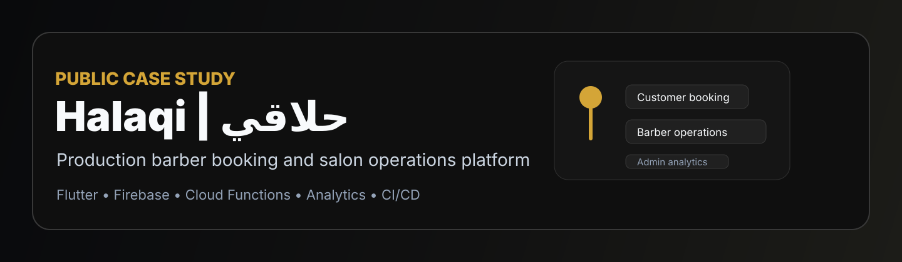
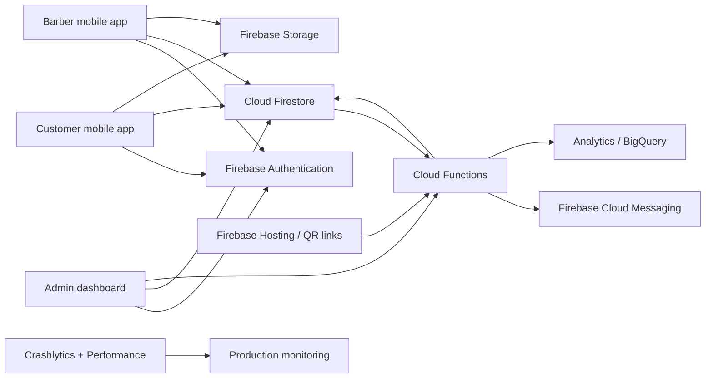
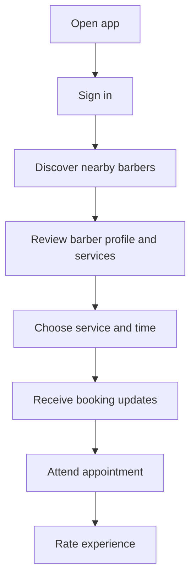
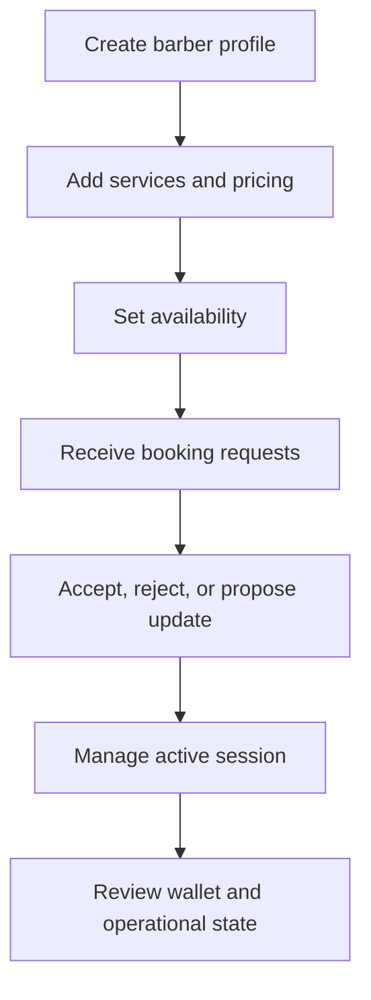
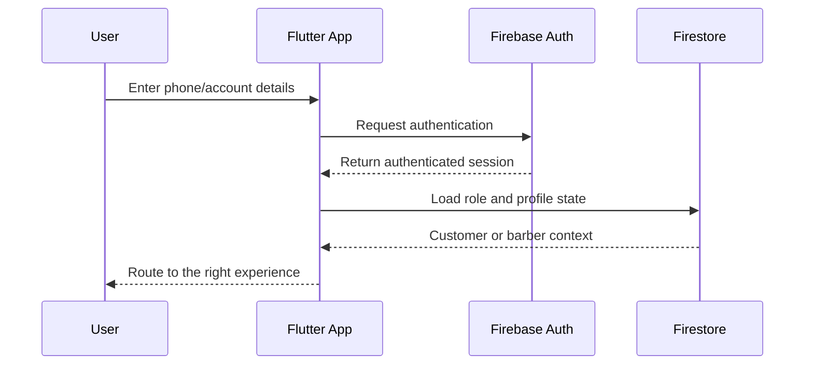
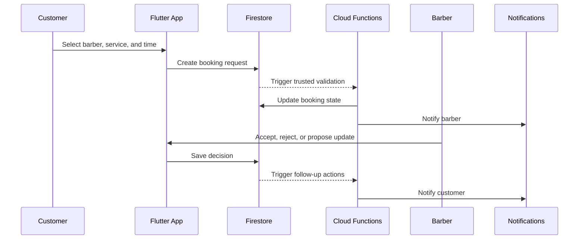
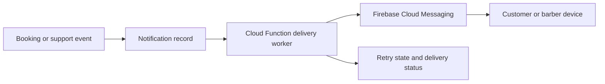
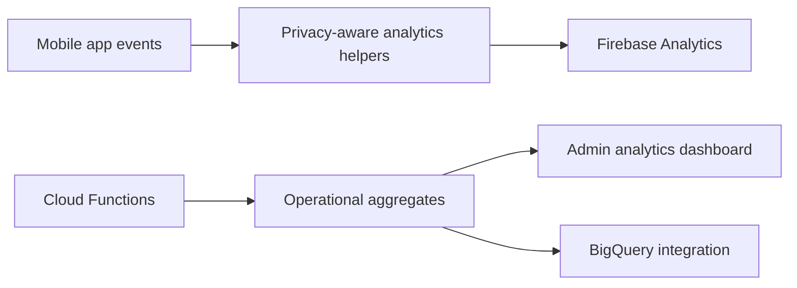
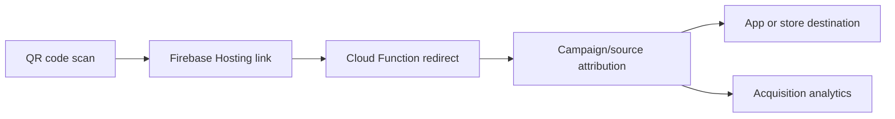

  

# Halaqi | حلاقي Case Study

Public engineering case study for Halaqi, a production-grade barber booking and salon operations platform for the Iraqi market.

This repository contains no production source code, secrets, Firebase configuration, customer data, signing material, internal URLs, or deployment credentials.

## Product Overview

Halaqi helps customers discover barbers, review services, choose available times, book appointments, receive notifications, and rate service quality. For barbers, it supports onboarding, profile management, service management, availability, booking operations, notifications, wallet workflows, and portfolio presentation.

The product also includes admin and operations workflows for customer and barber management, support, analytics, broadcast notifications, marketing campaigns, QR acquisition, system settings, monitoring, and release management.

Verified links:

- Website: https://halaqi-links.web.app
- App Store: https://apps.apple.com/ch/app/halaqi-%D8%AD%D9%84%D8%A7%D9%82%D9%8A/id6773111286
- Google Play: https://play.google.com/store/apps/details?id=com.haliqni.haliqni

## Problem

Many local barber workflows still depend on phone calls, messages, waiting in person, or guessing availability. That creates unclear wait times, missed appointments, overlapping bookings, limited service visibility, and difficult operational tracking for barbers.

## Target Users

| User | Need |
| --- | --- |
| Customers | Find barbers, compare services, book appointments, receive updates, and rate the experience. |
| Barbers | Manage services, availability, booking decisions, customer communication, wallet state, and profile presentation. |
| Admin operators | Monitor activity, support users, manage barbers, review analytics, run campaigns, and control system settings. |

## Key Features

| Area | Verified capabilities |
| --- | --- |
| Customer experience | Authentication, location-aware discovery, barber profiles, services, booking, notifications, history, ratings, support |
| Barber experience | Onboarding, profile, services, availability, booking queue, session actions, wallet, notifications, portfolio |
| Admin dashboard | Staff access, user management, support workflows, broadcast notifications, marketing banners, analytics, system settings |
| Backend | Cloud Functions, scheduled jobs, trusted booking operations, retry handling, QR attribution |
| Reliability | Crashlytics, performance monitoring, structured logs, CI/CD release checks |

## Technology Stack

| Layer | Stack |
| --- | --- |
| Mobile | Flutter, Dart, Android, iOS, Web |
| Architecture | Feature-based modules, Cubit/BLoC, Provider, GoRouter |
| Backend | Firebase, Cloud Functions, TypeScript, Node.js, Firebase Admin SDK |
| Data | Firestore, Firebase Storage, BigQuery integration |
| Messaging | Firebase Cloud Messaging, local notifications |
| Observability | Crashlytics, Performance Monitoring, Analytics, structured logs |
| Product ops | Remote Config, App Check, QR attribution, Firebase Hosting, admin workflows |
| CI/CD | Codemagic, GitHub Actions |

## High-Level Architecture

## Customer Journey

## Barber Journey

## Admin Dashboard

The admin dashboard supports operational visibility and controlled intervention across users, barbers, bookings, support, analytics, broadcasts, settings, security review, crash review, and marketing workflows. It exists as an operations tool, not a public user-facing app.

## Authentication Flow

## Booking Flow

## Notification Flow

## Analytics Architecture

## QR Attribution System

## CI/CD Overview

Halaqi uses Codemagic for signed Android and iOS release workflows and GitHub Actions for manual mobile build validation. Release checks include dependency installation, environment preparation, Firebase configuration presence, notification entitlement checks, Android build output, iOS build output, and artifact upload.

## Security Considerations

- Production source code remains private.
- Firebase config files are excluded from this public repository.
- Signing files and release credentials are excluded.
- User data, appointment data, phone numbers, location data, admin records, and analytics records are excluded.
- Public diagrams are intentionally high level and do not expose sensitive database rules or infrastructure details.
- Server-side operations are used for trusted booking and notification workflows.

## Scalability Considerations

- Firestore supports role-aware app state and real-time booking updates.
- Cloud Functions handle server-side validation, automation, scheduled work, and delivery workflows.
- Notification delivery uses retry state and normalized message types.
- Admin analytics are separated from customer-facing flows.
- CI/CD checks reduce release mistakes before store deployment.

## Monitoring And Crash Reporting

The production app uses Firebase Crashlytics, Performance Monitoring, Analytics, structured server logs, and admin-facing crash/analytics workflows to support debugging and product operations.

## Challenges Solved

- Coordinating two-sided customer and barber workflows.
- Keeping booking state consistent.
- Avoiding duplicate or conflicting bookings.
- Handling real-time updates across roles.
- Designing reliable notifications.
- Supporting admin operations without exposing production data.
- Building QR attribution without leaking campaign internals.
- Balancing quick iteration with production safeguards.

## Engineering Decisions

| Decision | Reason |
| --- | --- |
| Flutter | One production mobile codebase across Android and iOS. |
| Firebase | Fast path to authentication, database, storage, messaging, analytics, and monitoring. |
| Cloud Functions | Server-side authority for booking, notifications, automation, and admin operations. |
| Firestore | Realtime data model suited to booking and operational state. |
| Codemagic | Mobile-focused release automation. |
| GitHub Actions | Repeatable manual validation and build workflows. |

## Lessons Learned

- Product engineering is workflow design, not only feature delivery.
- Booking systems need trusted server-side decisions.
- Notifications require state, retries, audience rules, and observability.
- Admin tools are part of the architecture.
- Analytics should be designed with privacy limits from the start.
- CI/CD and crash monitoring are part of shipping.

## Future Roadmap

- Add sanitized screenshots with demo data.
- Publish a deeper architecture walkthrough.
- Add a public product demo video when sensitive data can be removed.
- Document QR attribution and analytics decisions in more detail.
- Add AI-assisted analytics experiments after data review.

## Repository Structure

| Path | Purpose |
| --- | --- |
| `assets/` | Public brand and preview assets. |
| `screenshots/` | Placeholder for sanitized screenshots only. |
| `architecture/` | Architecture diagrams and notes. |
| `diagrams/` | Mermaid diagram source files. |
| `docs/` | Supporting case-study documentation. |

