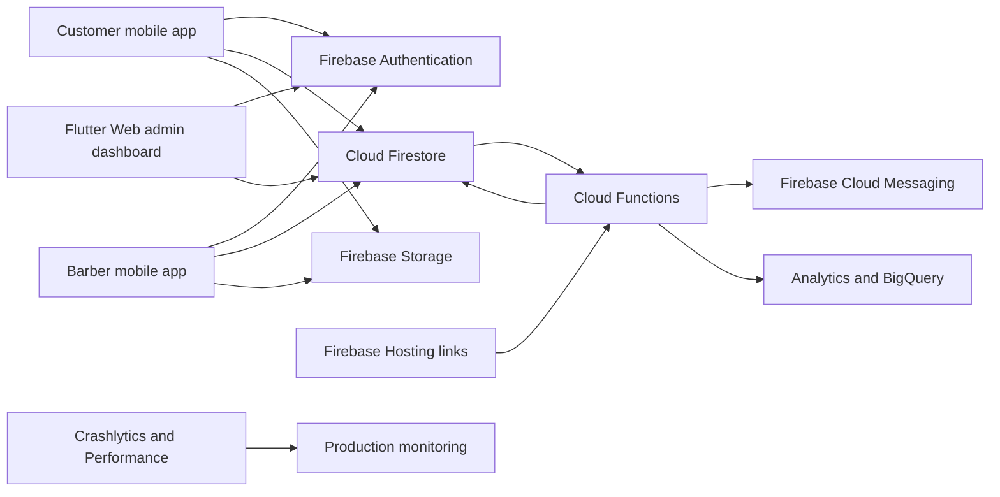
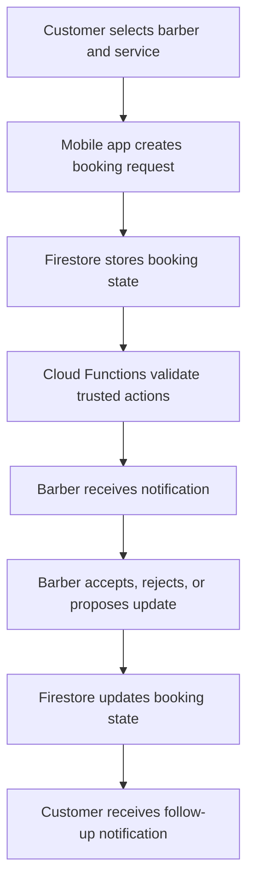
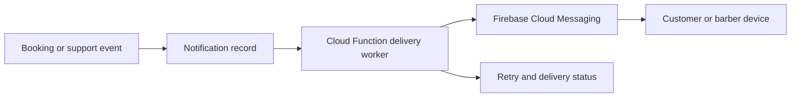
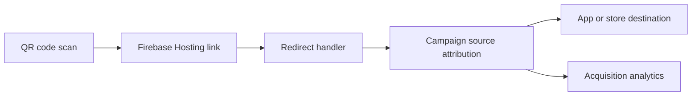
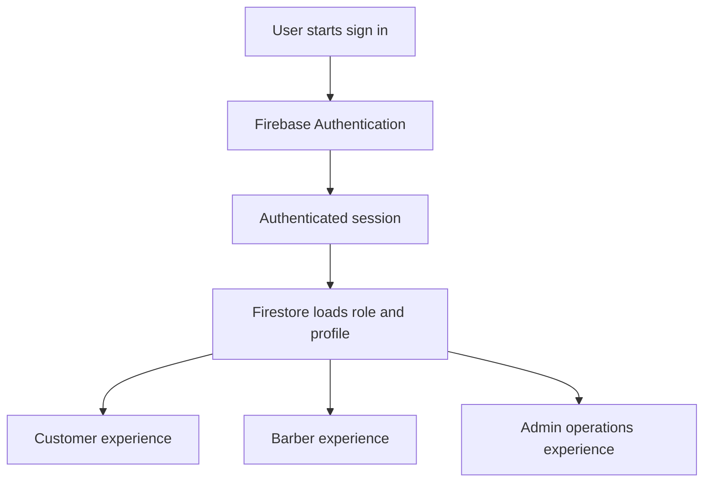
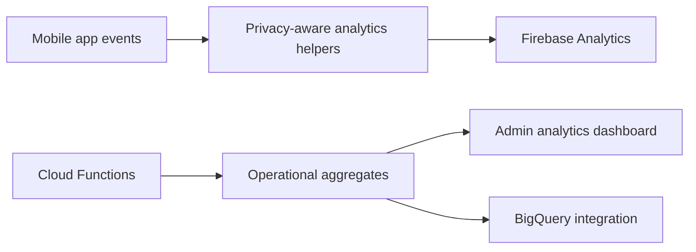

# Architecture Diagrams

These diagrams are intentionally high level. They describe public portfolio architecture without exposing production source code, security rules, secrets, customer records, internal dashboards, or deployment credentials.

## System Overview

## Booking Flow

## Notification Flow

## QR Attribution Flow

## Authentication Flow

## Analytics Flow

